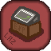

About Exp Factory
=======
[Exp Factory](https://legacy.curseforge.com/minecraft/mc-mods/exp-factory) (Short for Exponential Factory) is a mod about making every item in the game automatable for building factories.

Credits
=======

* LAZL0/CHE5T (Same Person)
  * Currently, the only one making this mod since I don't know anyone that knows how to code minecraft mods, including myself.

Warnings
=======
The mod is currently in development and missing most of the machines, blocks, and items that I plan on adding in the future. As well, The mod is unrefined and likely is unstable for current use, so install or copy code at your own risk.

If you plan to keep following this mod and don't speak english, I sadly have no plans of adding support for other languages. If this mod gets popular in the future I may add a way for community translation using something like Crowdin, but I don't know how to use Crowdin and have no plans for translations.